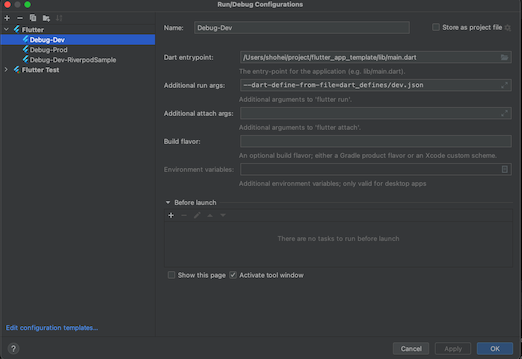
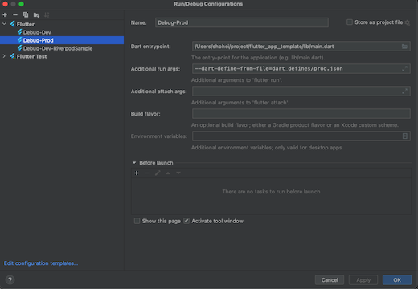

# flutter_app_template

Flutter + Firebase アプリのスターターキット、新規アプリ開発はこのテンプレートをベースに始める。

| カテゴリ       | 説明                            |
|------------|-------------------------------|
| 状態管理と DI   | flutter_hooks, hooks_riverpod |
| データモデル     | freezed, equatable          |
| クラウド DB    | cloud_firestore               |
| ローカル DB    | shared_preferences            |
| API クライアント | retrofit                      |
| 画面遷移       | go_router                     |
| Flavor設定       | --dart-define-from-file                     |
| テスト | flutter_test, integration_test, mockito |

## 環境

Flutter Stable 3.13.0

## 画面構成

- タブ 1
  - Hero アニメーションによるモーダル表示
  - SharedPreferences を用いた カウンター画面
  - Firestore を用いた カウンター画面
  - メールアドレス認証のサンプル
  - タイムラインのサンプル
- タブ 2
  - GithubApi を用いた Github Users の一覧画面
- タブ 3
  - Firestore を用いた Memo データ一覧と CRUD
    - データの追加、更新、削除
    - データ一覧の Pull-to-refresh
    - データ一覧の Infinite Scroll Pagination
- タブ 4
  - 設定画面
    - プロフィール 「名前」「誕生日」「画像」の表示と保存
    - アプリ名、パッケージ名、バージョンを表示
    - 株式会社 Never の URL を WebView で表示
    - ログアウト

## 実装済み

- iOS14、Android7 以上で動作
- DDD ライクな設計で構築
- Firebase を利用 (FirebaseAuth, Firestore, Functions, FirebaseAnalytics, FirebaseCrashlytics)
- retrofit を用いた サンプルコード
- 画面遷移は go_router（ShellRouteは未対応）
- ボトムナビゲーション構成のサンプル画面
- 画像選択・保存
- カメラ、画像のパーミッション設定
- 起動時に匿名認証でログイン
- ダークモード対応
- デバイス向きは縦固定
- 静的解析導入
- Android/iOS の Flavor 設定
- iOS 日本語デフォルト
- MethodChannelとEventChannelのサンプルコード
  - AndroidはTalkback、iOSはVoiceOverの設定状態の表示
- その他アプリに必要なライブラリを設定済み
- Unit tests（オフラインテスト）
- Widget tests（オフラインテスト）
- Integration tests（E2Eテスト）

※他プロジェクト移行によるビルドエラーを避けるため import は相対パスで実装していますが、移行後は import は絶対パスで利用します。

## やっていないこと

- fvm
- Android/iOS ローカル通知とプッシュ通知の設定
- Android の keystore の設定（debug, release）
- ローカライズ対応
- dartdoc
- fastlane
- テストでスクリーンショット撮影

## 設計指針

[こちらの資料](https://docs.google.com/presentation/d/19XERQBG-aWWD7R5NEJCyS8VXSeUL9KTENOe0ChYz_1M)にまとめました。

### ディレクトリ構成

- [lib/](./lib)
  - [exceptions/](./lib/exceptions)
  - [extensions/](./lib/extensions)
  - [gen/](./lib/gen)
  - [model/](./lib/model)
    - [converters/](./lib/model/converters)
    - [entities/](./lib/model/entities)
    - [repositories/](./lib/model/repositories)
    - [use_cases/](./lib/model/use_cases)
  - [presentation/](./lib/presentation)
    - [pages/](./lib/presentation/pages)
    - [res/](./lib/presentation/res)
    - [widgets/](./lib/presentation/widgets)
  - [results/](./lib/results)
  - [utils/](./lib/utils)
  - [main.dart](./lib/main.dart)

### Flavor

| 環境 | パッケージ名        | アプリ名           |
| ---- | ------------------- | ------------------ |
| 開発 | com.example.app.dev | dev.テンプレアプリ |
| 本番 | com.example.app     | 　テンプレアプリ   |

### 実行コマンド

- 開発

  ```sh
  flutter run --debug --dart-define-from-file=dart_defines/dev.json
  ```

- 本番

  ```sh
  flutter run --debug --dart-define-from-file=dart_defines/prod.json
  ```

Android Studio から実行する場合は、以下のように Run Configurations の Additional run args に `--dart-define-from-file` を設定する。

- dev環境でビルドする場合



- prod環境でビルドする場合



### リリースビルド

- Android

  ```sh
  flutter build appbundle --release --dart-define-from-file=dart_defines/prod.json
  ```

- iOS

  ```sh
  flutter build ipa --release --dart-define-from-file=dart_defines/prod.json
  ```

## テスト

### Unit tests

[テストコード](./test/model)

```sh
# Run all tests
flutter test

# Run target test
flutter test test/model/repositories/github_api/github_api_repository_test.dart
```

ドキュメント

- [Testing Flutter apps: Unit tests](https://docs.flutter.dev/testing#unit-tests)

### Widget tests

[テストコード](./test/presentation)

```sh
# Run all tests
flutter test

# Run target test
flutter test test/presentation/pages/sample/github_users/github_users_page_test.dart
```

ドキュメント

- [Testing Flutter apps: Widget tests](https://docs.flutter.dev/testing#widget-tests)

### Integration tests

[テストコード](./integration_test)

実機・シミュレータを起動させるので、実行コマンドにflavor設定のjsonを指定してください。

```sh
# Run all tests
flutter test --dart-define-from-file=dart_defines/dev.json integration_test

# Run target test
flutter test --dart-define-from-file=dart_defines/dev.json integration_test/github_users/github_users_page_test.dart
```

ドキュメント

- [Testing Flutter apps: Integration tests](https://docs.flutter.dev/testing#integration-tests)

### モック

[mockito](https://pub.dev/packages/mockito)を利用しています。モックのDIは[Riverpod](https://riverpod.dev/)の overrides を利用しています。

ドキュメント

- [Mock dependencies using Mockito](https://docs.flutter.dev/cookbook/testing/unit/mocking)

- [Riverpod Testing](https://docs-v2.riverpod.dev/docs/cookbooks/testing)

- [How to Unit Test AsyncNotifier Subclasses with Riverpod 2.0 in Flutter](https://codewithandrea.com/articles/unit-test-async-notifier-riverpod/)

## 新規プロジェクトへの移行方法

1.  git clone で取り込む

    ```
    git clone https://github.com/hukusuke1007/flutter_app_template.git
    ```

2.  取り込んだら .git を削除する

    ```
    rm -rf .git
    ```

3.  変更したいアプリ名、パッケージ名、プロジェクト名 にする

    - アプリ名を変更する
      - [dart-definesディレクトリ](./dart_defines/)内にあるjsonファイルの `appName` を変更する
  
    - `com.example.app` のパッケージ名を変更する
      - iOS:

        `Xcode > Runner > TARGETS Runner > Build Settings` の `Product Bundle Identifier` を変更。
        Debug, Profile, Release の全てを変更する。`$(appIdSuffix)`はそのままにしてください。
        

      - Android:

        - android/app/build.gradle
          - [applicationId](./android/app/build.gradle#L63)
        - AndroidManifest.xml - package

          - [main](./android/app/src/main/AndroidManifest.xml#L2)
          - [debug](./android/app/src/debug/AndroidManifest.xml#L2)
          - [profile](./android/app/src/profile/AndroidManifest.xml#L2)

        - MainActivity.kt
          - [package](./android/app/src/main/kotlin/com/example/app/MainActivity.kt#L1)

        - ScreenReaderPlugin.kt
          - [package1](./android/app/src/main/kotlin/com/example/app/ScreenReaderPlugin.kt#L1)
          - [package2](./android/app/src/main/kotlin/com/example/app/ScreenReaderPlugin.kt#L15)
          - [package3](./android/app/src/main/kotlin/com/example/app/ScreenReaderPlugin.kt#L25)

        - kotlin 配下のディレクトリ名を変更する

          （例）`com.example.app` から `com.never.jp` へ変更した場合

          ```
            変更前: android/app/src/main/kotlin/com/example/app
            変更後: android/app/src/main/kotlin/com/never/jp
          ```

    - プロジェクト名を変更する

      - `flutter_app_template` のディレクトリ名を変更する

        （例）`flutter_app_template`　から `never_app` へ変更

        ```
          変更前: flutter_app_template/
          変更後: never_app/
        ```

      - [pubspec.yaml の name](./pubspec.yaml#L1)

4.  新しい Firebase プロジェクトを構築する。
    開発環境、本番環境の 2 種類用意する。なお、開発環境のパッケージ名の末尾は必ず `.dev` を付与する。

    - [Firebase の構築方法](https://firebase.flutter.dev/docs/overview)

    構築した Firebase の設定ファイルを以下の場所へ設置する

    - Android

      ```
      # 開発環境
      android/app/src/dev/google-services.json
      # 本番環境
      android/app/src/prod/google-services.json
      ```

    - iOS

      ```
      # 開発環境
      ios/dev/GoogleService-Info.plist
      # 本番環境
      ios/prod/GoogleService-Info.plist
      ```

5.  Firebase コンソールから匿名認証を 開発環境、本番環境共に ON にする

6.  Flutter のライブラリを取り込む。 pub get を実行する。
    利用するバージョンを固定にするため、[pubspec.lock](./pubspec.lock) 内のプラグインのバージョンを見て [pubspec.yaml](./pubspec.yaml) のプラグインのバージョンを指定する。

7.  [実行コマンド](#実行コマンド)を用いて動作確認する。

8.  問題なければ新しい git repository を作成して本プロジェクトをプッシュする。

9.  あとは良しなに使わないプラグインやコードを削除して開発を進めてください。

## 参考文献

- [Dart/Flutter の静的解析強化のススメ](https://medium.com/flutter-jp/analysis-b8dbb19d3978)
- [Flutter/Dart における immutable の実践的な扱い方](https://medium.com/flutter-jp/immutable-d23bae5c29f8)
- [Riverpod の Provider 命名手引き](https://medium.com/flutter-jp/riverpod-naming-5031504fc692)
- [mono0926/wdb106-flutter](https://github.com/mono0926/wdb106-flutter)
- [Flutter x Riverpod でアプリ開発！実践入門](https://zenn.dev/riscait/books/flutter-riverpod-practical-introduction)
- [【Flutter 3.7以上】Dart-define-from-fileを使って開発環境と本番環境を分ける](https://zenn.dev/altiveinc/articles/separating-environments-in-flutter)
- [altive/flutter_app_template](https://github.com/altive/flutter_app_template)
- [現場で役立つシステム設計の原則](https://www.amazon.co.jp/%E7%8F%BE%E5%A0%B4%E3%81%A7%E5%BD%B9%E7%AB%8B%E3%81%A4%E3%82%B7%E3%82%B9%E3%83%86%E3%83%A0%E8%A8%AD%E8%A8%88%E3%81%AE%E5%8E%9F%E5%89%87-%E5%A4%89%E6%9B%B4%E3%82%92%E6%A5%BD%E3%81%A7%E5%AE%89%E5%85%A8%E3%81%AB%E3%81%99%E3%82%8B%E3%82%AA%E3%83%96%E3%82%B8%E3%82%A7%E3%82%AF%E3%83%88%E6%8C%87%E5%90%91%E3%81%AE%E5%AE%9F%E8%B7%B5%E6%8A%80%E6%B3%95-%E5%A2%97%E7%94%B0-%E4%BA%A8/dp/477419087X)
