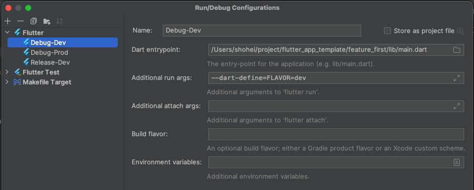
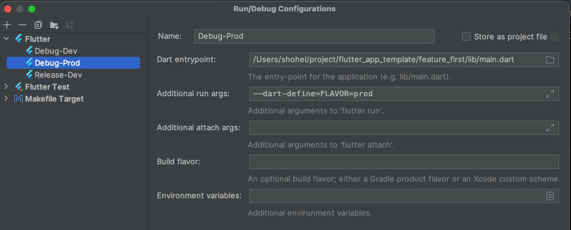
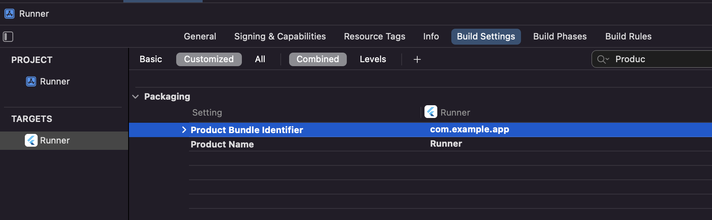

# [FeatureFirst] flutter_app_template

Flutter + Firebase アプリのスターターキット、新規アプリ開発はこのテンプレートをベースに始める。

| カテゴリ       | 説明                            |
|------------|-------------------------------|
| 状態管理と DI   | flutter_hooks, hooks_riverpod |
| データモデル     | freezed, equatable          |
| クラウド DB    | cloud_firestore               |
| ローカル DB    | shared_preferences            |
| API クライアント | retrofit                      |
| 画面遷移       | go_router                     |
| Flavor設定       | --dart-define-from-file  |
| テスト | flutter_test, integration_test, mockito |

## 画面構成

- タブ 1
  - Hero アニメーションによるモーダル表示
  - SharedPreferences を用いた カウンター画面
  - Firestore を用いた カウンター画面
  - メールアドレス認証のサンプル
  - タイムラインのサンプル
- タブ 2
  - GithubApi を用いた Github Users の一覧画面
- タブ 3
  - Firestore を用いた Memo データ一覧と CRUD
    - データの追加、更新、削除
    - データ一覧の Pull-to-refresh
    - データ一覧の Infinite Scroll Pagination
- タブ 4
  - 設定画面
    - プロフィール 「名前」「誕生日」「画像」の表示と保存
    - アプリ名、パッケージ名、バージョンを表示
    - 株式会社 Never の URL を WebView で表示
    - ログアウト

## 実装済み

- iOS14、Android7 以上で動作
- DDDライクなFeatureFirst構成で設計
- Firebase を利用 (FirebaseAuth, Firestore, Functions, FirebaseAnalytics, FirebaseCrashlytics)
- retrofit を用いた サンプルコード
- 画面遷移は go_router（ShellRouteは未対応）
- ボトムナビゲーション構成のサンプル画面
- 画像選択・保存
- カメラ、画像のパーミッション設定
- 起動時に匿名認証でログイン
- ダークモード対応
- デバイス向きは縦固定
- 静的解析導入
- Android/iOS の Flavor 設定
- iOS 日本語デフォルト
- MethodChannelとEventChannelのサンプルコード
  - AndroidはTalkback、iOSはVoiceOverの設定状態の表示
- その他アプリに必要なライブラリを設定済み
- fvm
- Unit tests（オフラインテスト）
- Widget tests（オフラインテスト）
- Integration tests（E2Eテスト）

## やっていないこと

- Android/iOS ローカル通知とプッシュ通知の設定
- Android の keystore の設定（debug, release）
- ローカライズ対応
- dartdoc
- fastlane
- テストでスクリーンショット撮影

## 設計指針

TODO

### ディレクトリ構成

- [lib/](./lib)
  - [core/](./lib/core)
    - [converters/](./lib/core/converters)
    - [custom_hooks/](./lib/core/custom_hooks)
    - [entities/](./lib/core/entities)
    - [exceptions/](./lib/core/exceptions)
    - [extensions/](./lib/core/extensions)
    - [repositories/](./lib/core/repositories)
    - [res/](./lib/core/res)
    - [router/](./lib/core/router)
    - [use_cases/](./lib/core/use_cases)
    - [utils/](./lib/core/utils)
    - [widgets/](./lib/core/widgets)
  - [features/](./lib/features)
    - [app_wrapper/](./lib/features/app_wrapper)
    - [authentication/](./lib/features/authentication)
    - [error/](./lib/features/error)
    - [firestore_counter/](./lib/features/firestore_counter)
    - [github_users/](./lib/features/github_users)
    - [home/](./lib/features/home)
    - [local_counter/](./lib/features/local_counter)
    - [memo/](./lib/features/memo)
    - [setting/](./lib/features/setting)
    - [start_up/](./lib/features/start_up)
    - [timeline/](./lib/features/timeline)
  - [app.dart](./lib/app.dart)
  - [main.dart](./lib/main.dart)

### Flavor

| 環境 | パッケージ名        | アプリ名           |
| ---- | ------------------- | ------------------ |
| 開発 | com.example.app.dev | dev.テンプレアプリ |
| 本番 | com.example.app     | 　テンプレアプリ   |

### 実行コマンド

- 開発

  ```sh
  flutter run --debug --dart-define-from-file=dart_defines/dev.json
  ```

- 本番

  ```sh
  flutter run --debug --dart-define-from-file=dart_defines/prod.json
  ```

Android Studio から実行する場合は、以下のように Run Configurations の Additional run args に `--dart-define-from-file` を設定する。

- dev環境でビルドする場合



- prod環境でビルドする場合



### リリースビルド

- Android

  ```sh
  flutter build appbundle --release --dart-define-from-file=dart_defines/prod.json
  ```

- iOS

  ```sh
  flutter build ipa --release --dart-define-from-file=dart_defines/prod.json
  ```

## テスト

### Unit tests

```sh
# Run all tests
flutter test

# Run target test
flutter test test/features/github_users/repositories/github_api_repository_test.dart
```

ドキュメント

- [Testing Flutter apps: Unit tests](https://docs.flutter.dev/testing#unit-tests)

### Widget tests

```sh
# Run all tests
flutter test

# Run target test
flutter test test/features/github_users/pages/github_users_page_test.dart
```

ドキュメント

- [Testing Flutter apps: Widget tests](https://docs.flutter.dev/testing#widget-tests)

### Integration tests

実機・シミュレータを起動させるので、実行コマンドにflavor設定のjsonを指定してください。

```sh
# Run all tests
flutter test --dart-define-from-file=dart_defines/dev.json integration_test

# Run target test
flutter test --dart-define-from-file=dart_defines/dev.json integration_test/features/github_users/pages/github_users_page_test.dart
```

ドキュメント

- [Testing Flutter apps: Integration tests](https://docs.flutter.dev/testing#integration-tests)

### モック

[mockito](https://pub.dev/packages/mockito)を利用しています。モックのDIは[Riverpod](https://riverpod.dev/)の overrides を利用しています。

ドキュメント

- [Mock dependencies using Mockito](https://docs.flutter.dev/cookbook/testing/unit/mocking)

- [Riverpod Testing](https://docs-v2.riverpod.dev/docs/cookbooks/testing)

- [How to Unit Test AsyncNotifier Subclasses with Riverpod 2.0 in Flutter](https://codewithandrea.com/articles/unit-test-async-notifier-riverpod/)

## 新規プロジェクトへの移行方法

1. git clone で取り込む

    ```sh
    git clone https://github.com/hukusuke1007/flutter_app_template.git
    ```

2. 取り込み後、`.git`を削除する

    ```sh
    rm -rf .git
    ```

3. 変更したいアプリ名、パッケージ名、プロジェクト名 にする

    - アプリ名を変更する
      - [dart-definesディレクトリ](./dart_defines/)内にあるjsonファイルの `appName` を変更する
  
    - `com.example.app` のパッケージ名を変更する
      - iOS:

        `Xcode > Runner > TARGETS Runner > Build Settings` の `Product Bundle Identifier` を変更。
        Debug, Profile, Release の全てを変更する。`$(appIdSuffix)`はそのままにしてください。
        

      - Android:

        - android/app/build.gradle
          - [applicationId](./android/app/build.gradle#L63)
        - AndroidManifest.xml - package

          - [main](./android/app/src/main/AndroidManifest.xml#L2)
          - [debug](./android/app/src/debug/AndroidManifest.xml#L2)
          - [profile](./android/app/src/profile/AndroidManifest.xml#L2)

        - MainActivity.kt
          - [package](./android/app/src/main/kotlin/com/example/app/MainActivity.kt#L1)

        - ScreenReaderPlugin.kt
          - [package1](./android/app/src/main/kotlin/com/example/app/ScreenReaderPlugin.kt#L1)
          - [package2](./android/app/src/main/kotlin/com/example/app/ScreenReaderPlugin.kt#L15)
          - [package3](./android/app/src/main/kotlin/com/example/app/ScreenReaderPlugin.kt#L25)

        - kotlin 配下のディレクトリ名を変更する

          （例）`com.example.app` から `com.never.jp` へ変更した場合

          ```md
            変更前: android/app/src/main/kotlin/com/example/app
            変更後: android/app/src/main/kotlin/com/never/jp
          ```

    - プロジェクト名を変更する

      - `flutter_app_template` のディレクトリ名を変更する

        （例）`flutter_app_template`　から `never_app` へ変更

        ```md
          変更前: flutter_app_template/
          変更後: never_app/
        ```

      - [pubspec.yaml の name](./pubspec.yaml#L1)

4. 新しい Firebase プロジェクトを構築する。
    開発環境、本番環境の 2 種類用意する。なお、開発環境のパッケージ名の末尾は必ず `.dev` を付与する。

    - [Firebase の構築方法](https://firebase.flutter.dev/docs/overview)

    構築した Firebase の設定ファイルを以下の場所へ設置する

    - Android

      ```md
      # 開発環境
      android/app/src/dev/google-services.json
      # 本番環境
      android/app/src/prod/google-services.json
      ```

    - iOS

      ```md
      # 開発環境
      ios/dev/GoogleService-Info.plist
      # 本番環境
      ios/prod/GoogleService-Info.plist
      ```

5. Firebase コンソールから匿名認証を 開発環境、本番環境共に ON にする

6. Flutter のライブラリを取り込む。 pub get を実行する。
    利用するバージョンを固定にするため、[pubspec.lock](./pubspec.lock) 内のプラグインのバージョンを見て [pubspec.yaml](./pubspec.yaml) のプラグインのバージョンを指定する。

7. [実行コマンド](#実行コマンド)を用いて動作確認する。

8. 問題なければ新しい git repository を作成して本プロジェクトをプッシュする。

9. あとは良しなに使わないプラグインやコードを削除して開発を進めてください。
